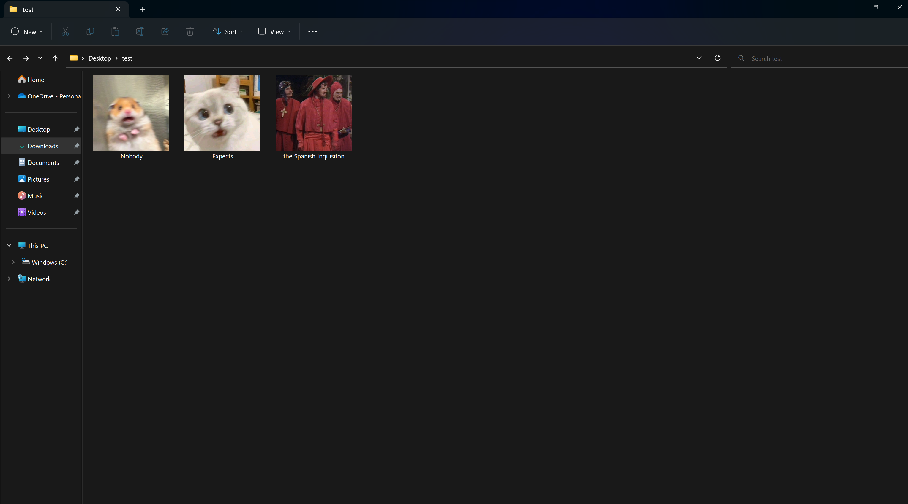

# windows-icon


A batch file to create a Windows folder with a custom icon.

## Usage

Open cmd or powershell and run:

```cmd
> [path_to_script]\icon.bat [path_to_new_folder] [path_to_icon]
```

_Notes:_

- _For file/directory names with spaces, enclose them in double quotes `""`_
- _Icon files typically have the extension `.ico` for use in Windows_

For example, if you ran

```cmd
> Desktop\icon.bat Desktop\test\Nobody Downloads\hamham.ico
> Desktop\icon.bat Desktop\test\Expects Downloads\blurred-shocked-cat.ico
> Desktop\icon.bat "Desktop\test\the Spanish Inquisiton" Downloads\spanish.ico
```

You'd get folders like so:


